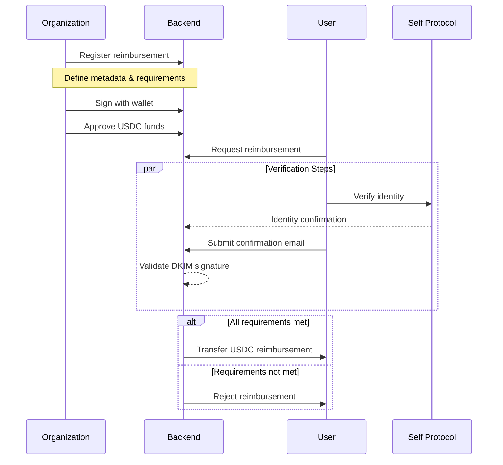

# Touchgrass
Enabling organizations to reimburse real-world expenses for employees, students, and hackers.

## Description
Organizations can register reimbursements for specific real-world expenses — such as taking an Uber ride to a designated destination, making a booking, or completing a purchase.
They can also define additional requirements, such as owning an NFT or not being from a country on the OFAC sanctions list.
Once users verify they meet the criteria, reimbursements are automatically issued.

## Technical
Our project is built with Next.js.

When an organization submits a reimbursement, they define the metadata and requirements users must meet to claim it. To confirm the submission, the organization signs a message with their wallet.
After that, they approve USDC to fund the reimbursement.

Users who want to claim a reimbursement must verify that all requirements are met:

On-chain events — like holding a specific NFT — are verified via an RPC call using the user’s wallet.
Identity-based criteria — such as not being from a country on the OFAC sanctions list — are verified using the Self protocol.
Off-chain actions — such as taking an Uber ride to a specific location — are validated using confirmation emails and their DKIM signatures.

Once all conditions are verified, rewards are automatically distributed via USDC transfers.
